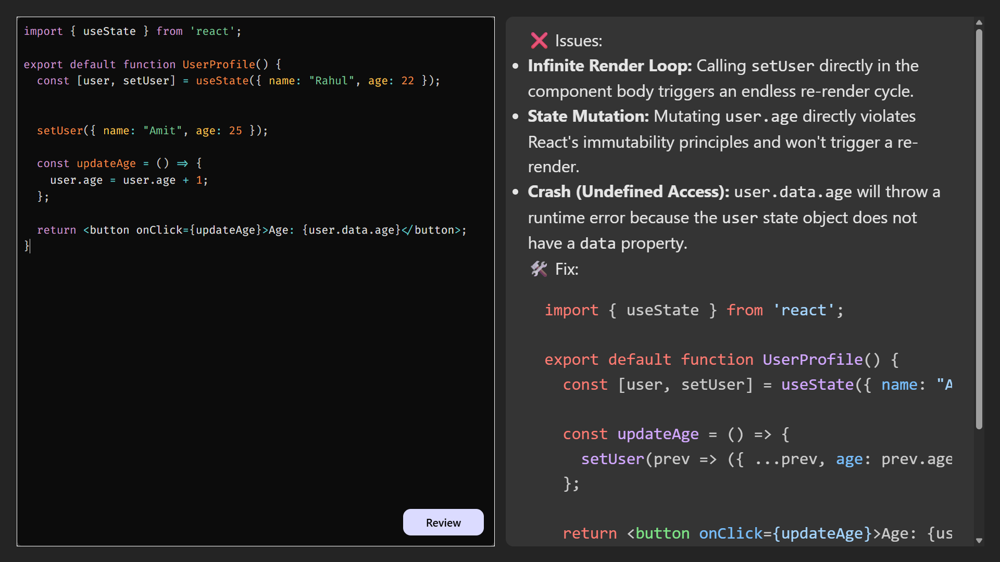

# 🤖 AI Code Reviewer

## Live Demo

- **Frontend (Vercel):** https://ai-code-reviewer-sooty-ten.vercel.app/

---

## 📸 Screenshot



---

## 🛠️ Tech Stack

### Frontend

- **Framework:** React (Vite)
- **Code Editor:** `react-simple-code-editor` & `prismjs`
- **Markdown Rendering:** `react-markdown` & `rehype-highlight`
- **HTTP Client:** Axios

### Backend

- **Environment:** Node.js
- **Framework:** Express.js
- **AI Integration:** Google Gemini API (or your respective AI model)

---

## ⚙️ Local Setup Instructions

### 1. Clone the Repository

```bash
git clone [https://github.com/your-username/your-repo-name.git](https://github.com/rajvircodes/AI-code-reviewer)
```
